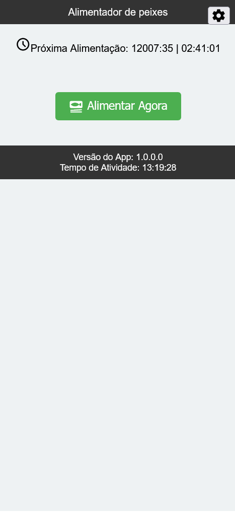
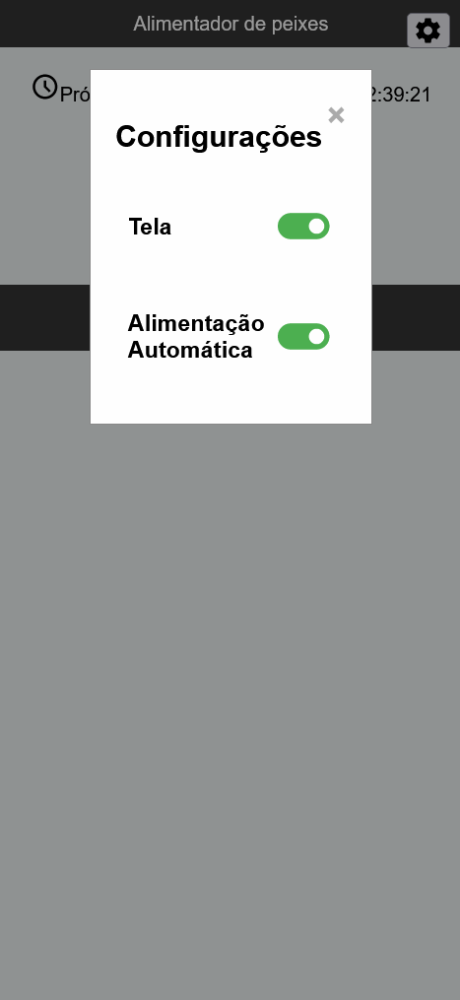
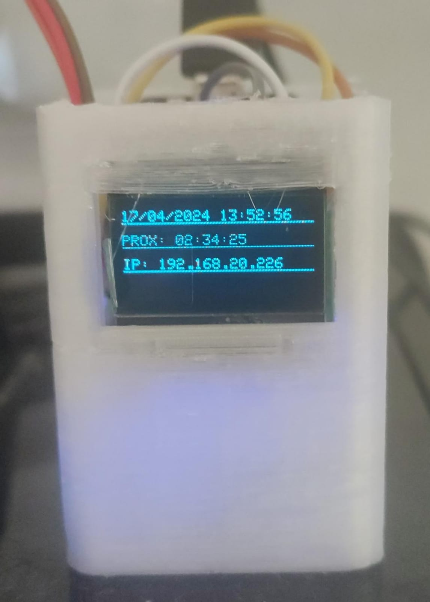
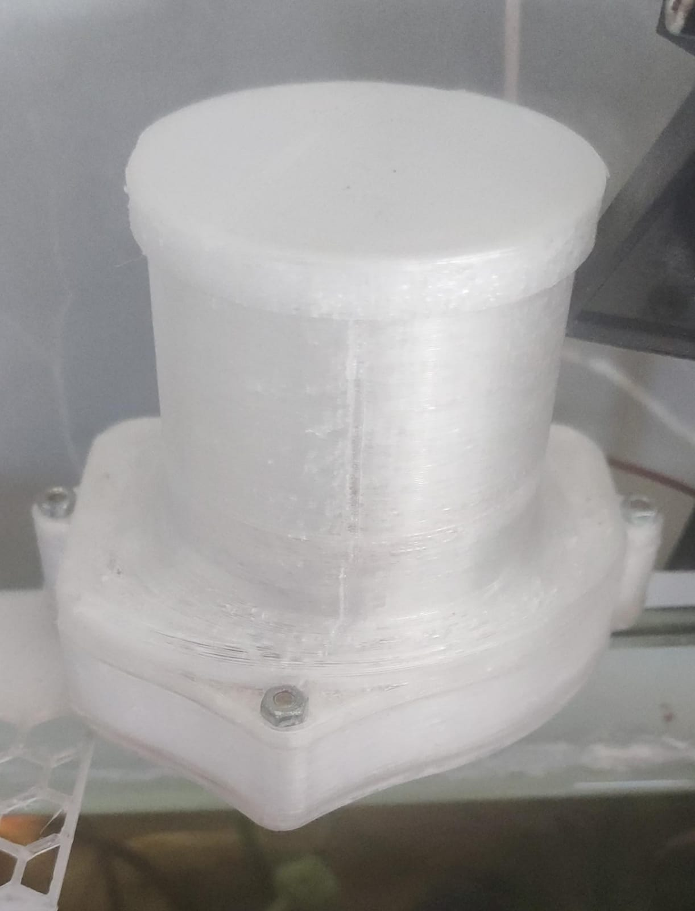

# Sistema para o alimentador dos peixes (Feed Fish)

Sistema para controlar a aliemntação de peixes em um aquário residencial.

Desenvolvido para ser integrado com o [modelo do alimentador][1] impresso através da impressora 3d, que movimenta um servo sg90 através de um esp8266.

## Controlador web

|  |  |
| :----------------------------: | :-------------------------------: |
|        *Tela Principal*        |      *Tela de configurações*      |

## Controlador no aquário

|  |  |
| :-------------------------------------------: | :------------------------------------------: |
|               *Case do esp8266*               |              [*Alimentador*][1]              |

## Características

- Uso de Esp8266
- Display OLED;
- Suporte offline;
- Integração com Alexa;
- Execução de alimentação a cada 4 horas;
- Portal Captive para configuração do WIFI.
- Página web para interação e configuração do alimentador;
- API REST para integração com outros sistemas.

## Pendências principais

- [ ] Refatoração de código
  - [ ] Melhorar a performance
  - [ ] Melhorar a manutenção
- [ ] Expandir as opções de configuração
- [ ] Melhorar as informações exibidas no display
- [ ] Suporte a expansão de componentes
  - [ ] Termômetro 
  - [ ] Nível de água
- [ ]  Módulo de segurança
  - [ ] Somente permitir acesso as configurações aos usuários autenticados;
  - [ ] Verificar a necessidade de bloqueio do botão de alimentação
- [ ] Atualização via OTA
  - [Integração com github?](https://blog.squix.org/2016/06/esp8266-continuous-delivery-pipeline-push-to-production.html)
- [ ] Integração com algum broker ou gerenciador de IoT
  - [iobroker](https://www.iobroker.net/)
  - [mDash](https://www.cnx-software.com/2019/08/20/mdash-cloud-platform-for-iot-devices-targets-esp8266-esp32-stm32-and-ti-cc3220-wireless-mcus/)
  - [iot-platform](https://www.aylanetworks.com/iot-platform)
  - [particle](https://www.particle.io)
  - [nymea](https://github.com/nymea)
  - [umh](https://www.umh.app/umh-integrated-platform-editions-and-pricing)
  - [openremote](https://www.openremote.io)
  - [knot](https://knot-devel.cesar.org.br/index.html)
  - [thingsboard](https://thingsboard.io)
  - [mainflux](https://mainflux.com/)

## Sugestão de Cases para Impressão

Veja a [página dedicada](docs/modelos_stl.md) com os modelos de arquivos para a impressão.

## Agradecimentos

- [ezTime](https://github.com/ropg/ezTime)
- [image2cpp](https://javl.github.io/image2cpp/)
- [ESPAsyncWiFiManager](https://github.com/alanswx/ESPAsyncWiFiManager)
- [ESPAsyncWebServer](https://github.com/esphome/ESPAsyncWebServer) 
- [ThingPulse](https://github.com/ThingPulse/esp8266-weather-station)
- [Bill Earl](https://learn.adafruit.com/multi-tasking-the-arduino-part-1/overview)
- [me-no-dev](https://github.com/me-no-dev/ESPAsyncWebServer)
- [Stefan Staub](https://github.com/sstaub/Ticker)
- [Tutorial sobre Display OLED](https://lastminuteengineers.com/oled-display-esp8266-tutorial/)

## Inspirações

- [iotFeeder](https://github.com/reivaxy/iotFeeder)
- [Automatic fish Tank Feeder](https://www.printables.com/model/582823/)
- [Automatic feeder for fish tank](https://www.printables.com/model/327334-automatic-feeder-for-fish-tank)
- [Automatic fish feeder](https://www.printables.com/model/32334-automatic-fish-feeder)
- [Automatic Fish Feeder for Flake Food](https://www.thingiverse.com/thing:6378659) 
  - Aqui eu acredito que é uma versão otimizada do meu alimentador.
## Projetos legais

- [Proteção para que o peixe não pule](https://www.thingiverse.com/thing:6583076)
- [Modular Fish Guard Frame for 10 & 12mm glass](https://www.thingiverse.com/thing:5177233)

[1]: https://cults3d.com/en/3d-model/tool/automatic-fish-feeder